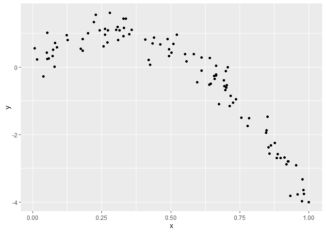
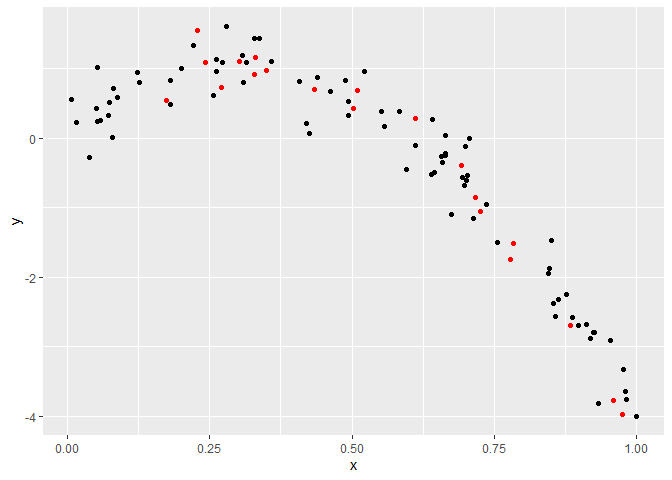
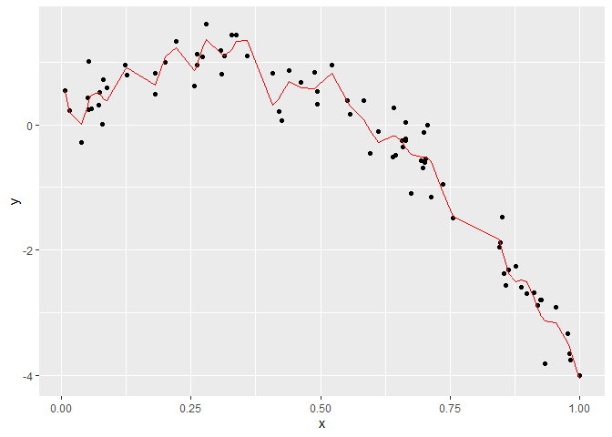

Cross Validation
================
Vanessa Dinh

## Step One

``` r
nonlin_df = 
  tibble(
    id = 1:100,
    x = runif(100, 0, 1),
    y = 1 - 10 * (x - .3) ^ 2 + rnorm(100, 0, .3)
  )

nonlin_df %>% 
  ggplot(aes(x = x, y = y)) + 
  geom_point()
```

<!-- -->

Let’s get this by hand. Making Training and Testing datasets for model
selection.

``` r
train_df = sample_n(nonlin_df, 80)
test_df = anti_join(nonlin_df, train_df, by = "id") 
#anti_join, codes for what is not in the training dataframe
```

``` r
ggplot(train_df, aes(x = x, y = y)) + 
  geom_point() + 
  geom_point(data = test_df, color = "red")
```

<!-- -->

Let’s try to fit htree models.

``` r
linear_mod = lm(y ~ x, data = train_df)
smooth_mod = mgcv::gam(y ~ s(x), data = train_df)
wiggly_mod = mgcv::gam(y ~ s(x, k = 30), sp = 10e-6, data = train_df)
```

Let’s see the results.

``` r
train_df %>% 
  add_predictions(wiggly_mod) %>% 
  ggplot(aes(x = x, y = y)) +
  geom_point() +
  geom_line(aes(y = pred), color = "red")
```

<!-- -->
Wiggly is too complex while linear is too simple and not a good
predictor. Use cross validation to confirm.

Let’s make predictions and compute Root Mean Squared Errors.

``` r
test_df %>% add_predictions(linear_mod) #long way
```

    ## # A tibble: 20 × 4
    ##       id     x      y    pred
    ##    <int> <dbl>  <dbl>   <dbl>
    ##  1     2 0.975 -3.98  -2.25  
    ##  2     3 0.727 -1.06  -1.25  
    ##  3    11 0.960 -3.78  -2.19  
    ##  4    12 0.778 -1.74  -1.45  
    ##  5    38 0.270  0.730  0.587 
    ##  6    41 0.717 -0.858 -1.21  
    ##  7    45 0.783 -1.51  -1.48  
    ##  8    49 0.510  0.688 -0.378 
    ##  9    52 0.329  0.917  0.350 
    ## 10    54 0.883 -2.69  -1.88  
    ## 11    57 0.693 -0.399 -1.11  
    ## 12    60 0.303  1.11   0.455 
    ## 13    65 0.502  0.427 -0.347 
    ## 14    75 0.174  0.547  0.973 
    ## 15    77 0.243  1.09   0.695 
    ## 16    79 0.350  0.967  0.265 
    ## 17    84 0.330  1.16   0.347 
    ## 18    89 0.434  0.701 -0.0708
    ## 19    91 0.229  1.55   0.751 
    ## 20    94 0.611  0.275 -0.783

``` r
rmse(linear_mod, test_df) #easier way
```

    ## [1] 0.815096

``` r
rmse(smooth_mod, test_df)
```

    ## [1] 0.2667968

``` r
rmse(wiggly_mod, test_df)
```

    ## [1] 0.3075676

``` r
#prediction error, lower is more accurate
```

## Can we iterate …?

``` r
cv_df =
  crossv_mc(nonlin_df, 100) %>% 
  mutate(
    train = map(train, as_tibble),
    test = map(test, as_tibble)
  ) %>% 
  mutate(
    linear_fits = map(.x = train, ~lm(y ~ x, data = .x))
  )
```
